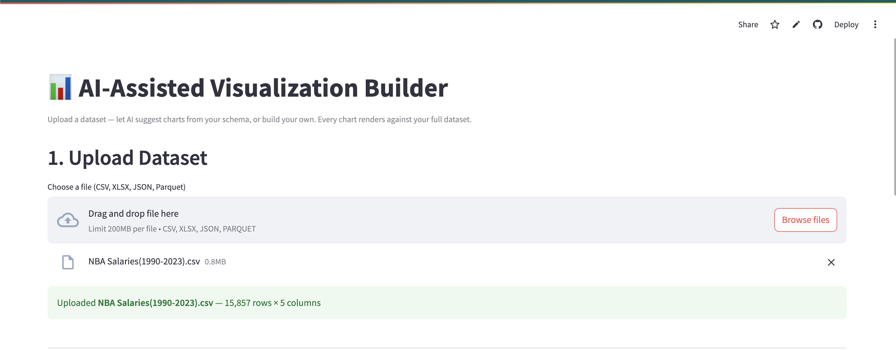
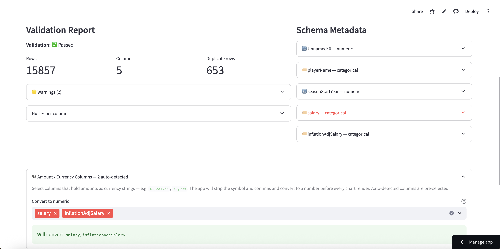
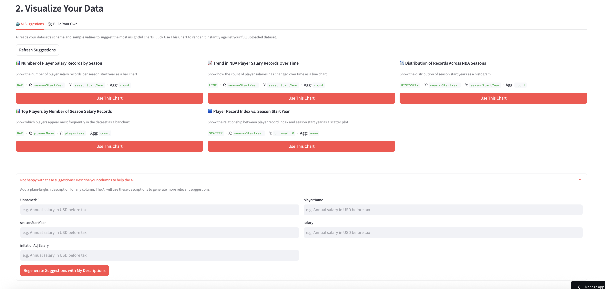
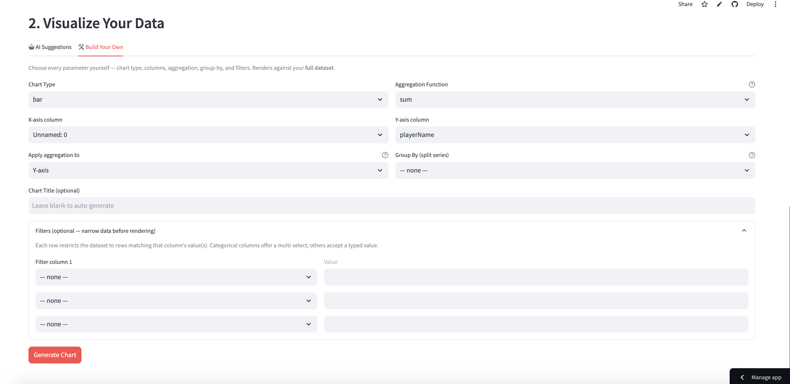
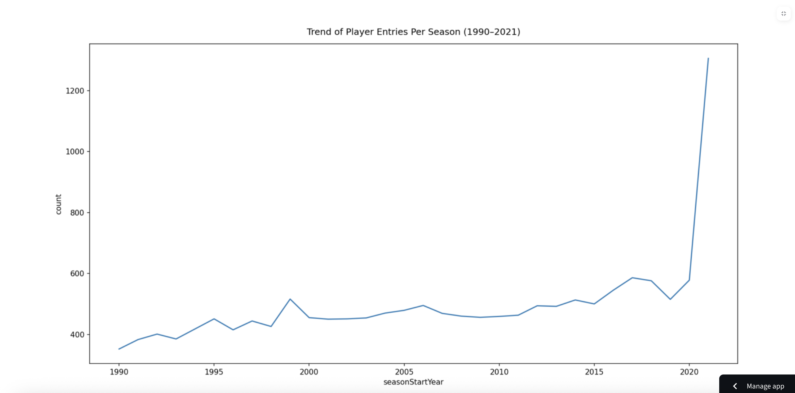
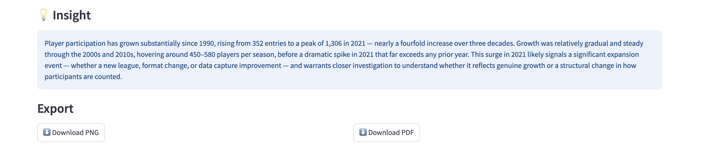
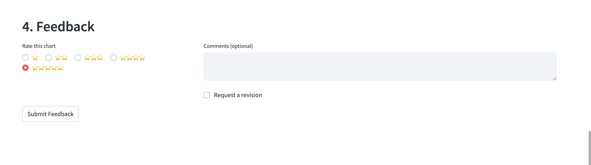

# AI-Assisted Visualization Builder for Business Data

A Python-first AI visualization builder that transforms uploaded structured business datasets into validated charts and AI-generated insights — powered by Claude and deployable to Streamlit Community Cloud with zero configuration.

---

## Table of Contents

- [Project Description](#project-description)
- [Live Demo](#live-demo)
- [How It Works — A Step-by-Step Walkthrough](#how-it-works--a-step-by-step-walkthrough)
- [Features](#features)
- [Architecture](#architecture)
- [System Flow](#system-flow)
- [Security & Guardrails](#security--guardrails)
- [Data Model](#data-model)
- [Tech Stack](#tech-stack)
- [Getting Started](#getting-started)
- [Project Structure](#project-structure)
- [Supported File Formats](#supported-file-formats)
- [API Reference](#api-reference)
- [Data Quality Checks](#data-quality-checks)
- [Success Metrics](#success-metrics)
- [Stakeholder Value](#stakeholder-value)
- [Future Enhancements](#future-enhancements)

---

## Project Description

This application lets users upload structured business datasets and immediately receive AI-generated chart suggestions tailored to the data's schema — or manually configure every chart parameter themselves. No SQL, Python, or BI tool expertise is required.

The AI analyzes the uploaded dataset's column names, types, and statistics, then automatically proposes up to five meaningful visualizations such as:

- Revenue totals grouped by region (bar chart)
- Salary distribution across the workforce (histogram)
- Headcount trends over time (line chart)
- Overtime breakdown by department (grouped bar)

Each suggestion is a fully specified chart rendered instantly against the full dataset and accompanied by a 2–3 sentence plain-English insight summary.

---

## Live Demo

Deployed on Streamlit Community Cloud. Set `ANTHROPIC_API_KEY` in the app's Secrets dashboard and point the main file to `frontend/app.py`.

---

## How It Works — A Step-by-Step Walkthrough

No coding required. Here is exactly what you will see from the moment you open the app to the moment you download your finished chart.

---

### Step 1 — Upload Your Data File



Start by dragging your spreadsheet or data file onto the upload area, or click **Browse files** to pick it from your computer. The app accepts the most common data formats — CSV, Excel, JSON, and Parquet files up to 200 MB. Once the file lands, you will immediately see a green confirmation banner telling you how many rows and columns were found. In this example an NBA salary dataset with 15,857 rows and 5 columns was uploaded in under a second.

---

### Step 2 — Review Your Data Quality Report



The app automatically checks your data for common problems — missing values, duplicate rows, and columns that look like numbers but were stored as text (for example, salary amounts written as `$1,234`). You will see a **Validation Report** on the left showing how many rows and columns passed the check, plus any warnings worth knowing about. On the right, the **Schema Metadata** panel breaks down every column: what type of data it holds, how many unique values it has, and a few sample entries so you can confirm the app read your file correctly.

Below the report, the app automatically spots any columns that hold dollar amounts or other currency values and offers to convert them to plain numbers before charting. Pre-selected columns are shown in a green pill — you can add or remove them with one click.

---

### Step 3A — Let the AI Suggest Charts



Switch to the **AI Suggestions** tab and click **Get AI Suggestions**. Within a few seconds the AI reads your column names, data types, and sample values and proposes up to five ready-to-use charts — each one labelled with the chart type, which columns it uses, and a plain-English sentence explaining what the chart will show you. Click **Use This Chart** on any card to render it instantly against your full dataset.

If the suggestions are not quite right for your use case, expand the **"Not happy with these suggestions?"** section at the bottom. Type a short description next to any column name — for example, *"Annual salary in USD before tax"* — then click **Regenerate Suggestions with My Descriptions**. The AI will use your descriptions to come up with more relevant ideas.

---

### Step 3B — Build Your Own Chart (Optional)



Prefer full control? Switch to the **Build Your Own** tab. Use the dropdowns to choose a chart type (bar, line, scatter, pie, or histogram), pick which column goes on each axis, choose how numbers should be summarised (total, average, count, etc.), and optionally split the chart into colour-coded groups. You can also narrow the data with up to three filters — for example, show only players from a specific season or team — before clicking **Generate Chart**.

---

### Step 4 — View Your Chart



Your chart appears instantly, rendered against every row of your uploaded dataset. It is sized automatically so labels never overlap and the chart is easy to read — wide datasets get a wider canvas, dense pie charts move their labels into a legend. This example shows a line chart of NBA player entries per season from 1990 to 2021, revealing a dramatic spike in 2021.

---

### Step 5 — Read the AI Insight and Export



Beneath every chart the AI writes a 2–3 sentence **Insight** summarising the most important pattern in plain English — no data expertise needed to understand it. When you are ready to share the chart, click **Download PNG** for an image file or **Download PDF** for a print-ready document.

---

### Step 6 — Rate the Chart



At the bottom of the page you can give the chart a star rating from 1 to 5, leave an optional comment, and tick **Request a revision** if you would like a different take. Your feedback is saved so the team can continue improving the AI suggestions over time.

---

## Features

### Two visualization paths

**AI Suggestions tab** — click once to receive up to 5 AI-generated chart ideas tailored to the uploaded dataset's schema. Each suggestion renders immediately against the full dataset. If the suggestions miss the mark, expand the **"Describe your columns"** helper to add plain-English descriptions for any column and regenerate — Claude will use the descriptions to produce more relevant charts.

**Build Your Own tab** — full manual control over every parameter:
- Chart type (bar, line, scatter, pie, histogram)
- X-axis and Y-axis column selectors
- Aggregation function (sum, mean, count, max, min, none) with axis direction control
- Group By column for multi-series charts
- Up to 3 simultaneous column filters (categorical multiselect or free-text)

### Data handling
- Upload CSV, XLSX, JSON, and Parquet files (up to 100 MB)
- Automatic schema profiling — detected types, null %, unique counts, min/max, sample values
- Currency / amount column auto-detection and symbol stripping (`$€£¥₹₩₺₽`)
- Raw data stored in RAM only — never written to disk or the database

### AI layer
- Schema-driven chart suggestions — Claude reads column metadata and proposes up to 5 chart specs (`suggest_with_specs`)
- Each suggestion includes chart type, axes, aggregation, and a plain-English description
- 2–3 sentence insight summary generated per rendered chart (`generate_insight`)
- Input and output guardrails on all API endpoints (see [Security & Guardrails](#security--guardrails))

### Output
- Matplotlib-rendered PNG charts with dynamic sizing and layout
- AI insight panel below each chart
- PNG and PDF export
- Star-rating feedback form per output

---

## Architecture

The frontend and backend run **in the same Python process** — no HTTP server is spawned and no network calls are made between the UI and the backend logic. This makes the app deployable to Streamlit Community Cloud without a separate server.

```text
+-------------------------------------------------------+
|                  Streamlit Frontend                   |
|   Upload UI | AI Suggestions | Chart View | Export     |
+-----------------------------+-------------------------+
                              | direct Python calls
                              v
+-------------------------------------------------------+
|                    Backend Modules                    |
|                                                       |
|  +-----------------+     +-------------------------+  |
|  | ingestion.py    |     | guardrails.py           |  |
|  | File parsing    |     | Input validation        |  |
|  | Validation      |     | Output sanitization     |  |
|  +-----------------+     +-------------------------+  |
|           |                         |                 |
|           v                         v                 |
|  +-----------------+     +-------------------------+  |
|  | profiler.py     |     | ai_layer.py             |  |
|  | Schema metadata |---->| Claude API calls        |  |
|  | LLM context     |     | interpret_prompt()      |  |
|  +-----------------+     | generate_insight()      |  |
|           |              | suggest_with_specs()    |  |
|           v              +-------------------------+  |
|  +-----------------+               |                  |
|  | session_store   |               v                  |
|  | In-memory store |     +-------------------------+  |
|  | TTL-based evict |     | chart_engine.py         |  |
|  +-----------------+     | Pandas transforms       |  |
|           |              | Matplotlib rendering    |  |
|           |              | PNG output              |  |
|           v              +-------------------------+  |
|  +-----------------+                                  |
|  | database.py     |                                  |
|  | SQLAlchemy ORM  |                                  |
|  | Supabase/PG     |                                  |
|  | (optional)      |                                  |
|  +-----------------+                                  |
+-------------------------------------------------------+
```

---

## System Flow

```text
[User Uploads File]
        |
        v
[File Intake & Validation]
  • Type / size check
  • Schema validation
  • Null / duplicate detection
        |
        v
[Schema Profiling Engine]
  • Type inference per column
  • Null %, unique counts, min/max
  • Sample values, all categories
        |
        v
[In-Memory Session Store]  ←── raw DataFrame (RAM only, 30-min TTL)
        |
        +-----------------------------------------------+
        |                                               |
        v                                               v
  [PATH A — AI Suggestions]                  [PATH B — Build Your Own]
  User clicks "Get AI Suggestions"           User picks chart type, axes,
                                             aggregation, filters manually
        |
        v
  [Guardrails — Input]
   Applied to all API calls
        |
        v
  [Claude API — suggest_with_specs()]
   Schema metadata → 5 chart specs
   (chart type, axes, aggregation, title)
        |
        v
  [Suggestion cards displayed in UI]
  User clicks "Use This Chart"
        |                                               |
        +-------------------+---------------------------+
                            |
                            v
               [Guardrails — Input validation]
                Applied at API boundary
                            |
                            v
              [Chart Generation Engine]
               Filters → Aggregation → Render
               Matplotlib PNG → data/outputs/
                            |
                            v
              [Claude API — generate_insight()]
               VizSpec + computed stats →
               2–3 sentence plain-English summary
                            |
                            v
              [Guardrails — Output sanitization]
               Redact secrets / strip control chars
                            |
                            v
           [Chart + Insight displayed in UI]
                            |
                            v
            [Export PNG / PDF | Star-rating Feedback]
```

---

## Security & Guardrails

All text fields accepted by the API endpoints pass through `backend/guardrails.py` before reaching the Claude API. Every Claude response is sanitized before it reaches the user. This protects against malicious API-level attacks even though the standard UI does not expose a free-text prompt box.

### Input guardrails — `validate_input(text)`

| Category | What is detected and blocked |
|---|---|
| **Length** | Input longer than 2 000 characters |
| **Prompt injection** | "ignore previous instructions", "forget directives", "override system", "you are now", "jailbreak", "DAN mode", "do anything now", "no restrictions", attempts to read back the system prompt |
| **Secret extraction** | Requests for API keys, passwords, credentials, `.env` contents, `ANTHROPIC_API_KEY`, database URLs, "exfiltrate" |
| **Social engineering** | Role-play, "act as if", "hypothetically", "without restrictions", `<system>` tags, `[INST]` / `[/INST]` markers, fictional-scenario bypasses |

All checks run on **NFKC-normalized** text to defeat homoglyph and full-width Unicode character obfuscation.

### Output guardrails

| Function | What it does |
|---|---|
| `sanitize_insight()` | Strips control characters; redacts `sk-ant-*` Anthropic keys, `sk-*` keys, base64 tokens, and database connection strings; caps at 1 500 chars |
| `sanitize_title()` | Strips control characters; caps at 200 chars |
| `validate_viz_spec_output()` | Scans all text fields in the returned VizSpec for potential secrets |

### API boundary

`POST /prompt`, `POST /interpret`, and `POST /render` all call `validate_input()` before processing. Violations return **HTTP 422** with a user-safe message.

---

## Data Model

Supabase (PostgreSQL) is used exclusively to persist user feedback. All other data — uploaded DataFrames, schema profiles, chart specs, and insights — lives in RAM for the duration of the session and is never written to the database.

### Feedback table (`feedbacks`)

| Field | Type | Notes |
|---|---|---|
| `feedback_id` | UUID (PK) | Auto-generated |
| `output_id` | UUID | Local chart identifier — no FK |
| `session_id` | string | Session that produced the chart |
| `rating` | integer (1–5) | Star rating submitted by the user |
| `comments` | string | Optional free-text comment |
| `revision_requested` | boolean | Whether the user asked for a revision |
| `chart_type` | string | bar / line / scatter / pie / histogram |
| `chart_title` | string | Title of the rated chart |
| `submitted_at` | timestamptz | Auto-set on insert |

> `DATABASE_URL` is optional. When unset, feedback submission is a silent no-op and the app works fully without a database.

---

## Tech Stack

| Layer | Technology |
|---|---|
| Frontend | Streamlit |
| Backend | FastAPI (also callable in-process) |
| AI / LLM | Anthropic Claude API (`claude-sonnet-4-6`) |
| Data processing | Pandas, NumPy |
| Chart rendering | Matplotlib |
| Schema validation | Pydantic, pydantic-settings |
| Database ORM | SQLAlchemy |
| Database | Supabase (PostgreSQL) — optional |
| File formats | CSV, XLSX, JSON, Parquet |
| Testing | pytest |
| Deployment | Streamlit Community Cloud |

---

## Getting Started

### Prerequisites

- Python 3.12
- An Anthropic API key

### Local setup

```bash
# 1. Clone the repo
git clone <repo-url>
cd CapStone

# 2. Create and activate a virtual environment
python3.12 -m venv .venv
source .venv/bin/activate      # Windows: .venv\Scripts\activate

# 3. Install dependencies
pip install -r requirements.txt

# 4. Configure environment
cp .env.example .env
# Edit .env and set ANTHROPIC_API_KEY=your-key-here
# DATABASE_URL is optional — leave blank to skip persistence

# 5. Run the app
streamlit run frontend/app.py
```

The app opens at `http://localhost:8501`. No separate backend server needed.

### Local setup with Streamlit secrets (alternative)

```bash
cp .streamlit/secrets.toml.example .streamlit/secrets.toml
# Edit secrets.toml and fill in ANTHROPIC_API_KEY
streamlit run frontend/app.py
```

### Running tests

```bash
pip install -r requirements-dev.txt
pytest tests/
```

### Streamlit Cloud deployment

1. Push the repo to GitHub.
2. Create a new app in the Streamlit Community Cloud dashboard.
3. Set **Main file path** to `frontend/app.py`.
4. Under **Settings → Secrets**, add:
   ```toml
   ANTHROPIC_API_KEY = "sk-ant-..."
   DATABASE_URL = "postgresql://..."   # optional
   ```
5. Deploy — no backend subprocess required.

---

## Project Structure

```text
CapStone/
├── backend/
│   ├── ai_layer.py        # Claude API calls: interpret_prompt, generate_insight, suggest_with_specs
│   ├── chart_engine.py    # Pandas transforms + Matplotlib rendering
│   ├── config.py          # pydantic-settings configuration
│   ├── database.py        # SQLAlchemy engine (lazy, optional)
│   ├── guardrails.py      # Input validation + output sanitization
│   ├── ingestion.py       # File parsing + validation
│   ├── main.py            # FastAPI app + all endpoints
│   ├── models.py          # SQLAlchemy ORM models
│   ├── profiler.py        # Schema profiling engine
│   └── session_store.py   # In-memory DataFrame store with TTL eviction
├── frontend/
│   └── app.py             # Streamlit UI (calls backend modules in-process)
├── data/
│   ├── outputs/           # Rendered chart PNGs
│   └── samples/           # Demo datasets
├── tests/
│   ├── test_ai_layer.py
│   ├── test_guardrails.py
│   ├── test_ingestion.py
│   └── test_profiler.py
├── .streamlit/
│   ├── config.toml
│   └── secrets.toml.example
├── .env.example
├── .python-version        # Pins Python 3.12 for Streamlit Cloud
├── requirements.txt
├── requirements-dev.txt
└── checkpoint.md
```

---

## Supported File Formats

| Format | Extension | Notes |
|---|---|---|
| CSV | `.csv` | UTF-8 and latin-1 encoding detection |
| Excel | `.xlsx` | First sheet loaded by default |
| JSON | `.json` | Records and columns orientation supported |
| Parquet | `.parquet` | Full support |

Maximum upload size: 100 MB (configurable via `MAX_UPLOAD_SIZE_MB`).

---

## API Reference

All endpoints are defined in `backend/main.py` and also callable directly as Python functions from the frontend.

| Method | Path | Description |
|---|---|---|
| `GET` | `/health` | Liveness check |
| `POST` | `/upload` | Upload a file; returns `session_id` and schema profile |
| `POST` | `/prompt` | Natural language → chart + insight |
| `POST` | `/interpret` | Natural language → VizSpec only (no render) |
| `POST` | `/render` | Render from a confirmed VizSpec |
| `POST` | `/suggest` | Return AI chart suggestions (no render) |
| `POST` | `/auto-preview` | Return AI suggestions with rendered thumbnails |
| `GET` | `/chart/{output_id}` | Retrieve a rendered chart PNG |
| `POST` | `/feedback` | Submit a star rating and optional comment |

All prompt-accepting endpoints enforce input guardrails and return **HTTP 422** on violations.

---

## Data Quality Checks

Applied automatically during ingestion (`backend/ingestion.py`):

- **File validation** — reject unsupported types and files exceeding the size limit
- **Schema validation** — confirm consistent headers and readable structure
- **Null checks** — calculate missing value percentage per column
- **Duplicate checks** — detect duplicate records
- **Type inference** — coerce numeric, categorical, and datetime columns to consistent types
- **Range validation** — flag unexpected negative values
- **Date standardization** — detect and normalize mixed date formats
- **Prompt-to-data alignment** — flag requested columns that don't exist; suggest closest matches

Example validation messages surfaced to the user:

- "Department column has 12% missing values"
- "Date column contains mixed formats — standardized to ISO 8601"
- "Requested metric 'revenue' not found; closest match is 'total_revenue'"

---

## Success Metrics

### Technical
- Prompt-to-chart success rate
- Chart generation response time
- Schema detection accuracy
- Failure rate for invalid prompt-to-column mapping
- Guardrail block rate (injection / secret extraction attempts)

### User experience
- Star rating per generated output (1–5)
- Number of chart refinements per session
- Time from upload to first chart
- First-attempt acceptance rate

### Targets
- 85%+ first-pass chart generation success
- Under 10 seconds average response for medium datasets
- 70%+ user acceptance within two iterations

---

## Stakeholder Value

**Business users** — create charts from plain-English descriptions without SQL or Python skills.

**Data analysts** — offload repetitive chart generation; focus on deeper analysis.

**Managers** — faster access to visual summaries during payroll review, operations tracking, and finance reporting.

**Engineering teams** — reference implementation of LLM + structured data integration with production-grade guardrails and cloud deployment.

---

## Future Enhancements

- Dashboard generation from multiple prompts in a single session
- Role-based access for team collaboration
- Database connector support (query instead of file upload)
- Template memory for repeated reporting patterns
- Anomaly detection and forecasting overlays
- Conversational follow-up prompts within a session
- Scheduled report generation
